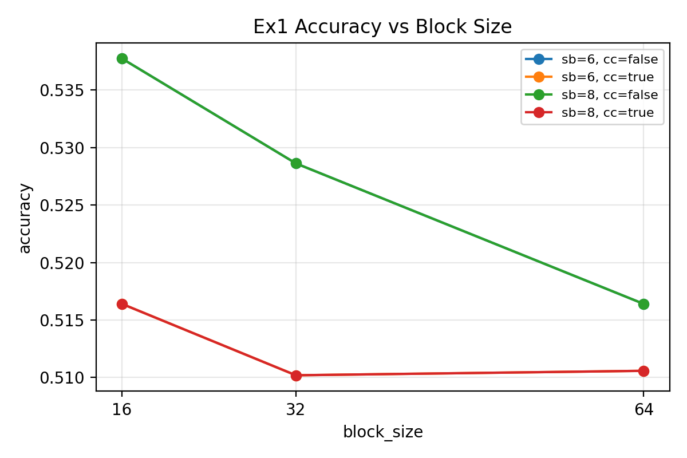
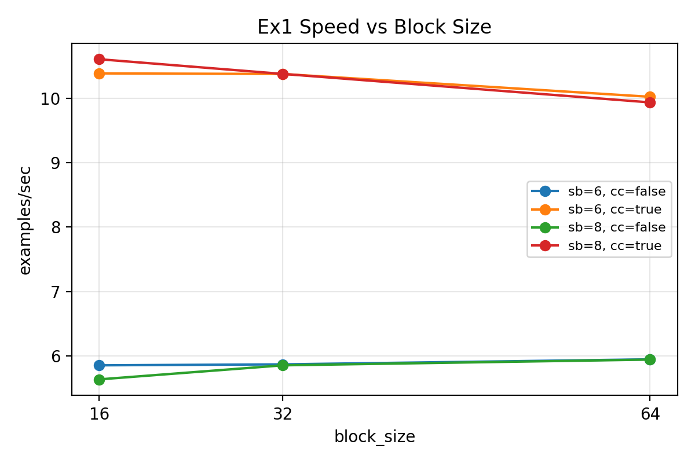
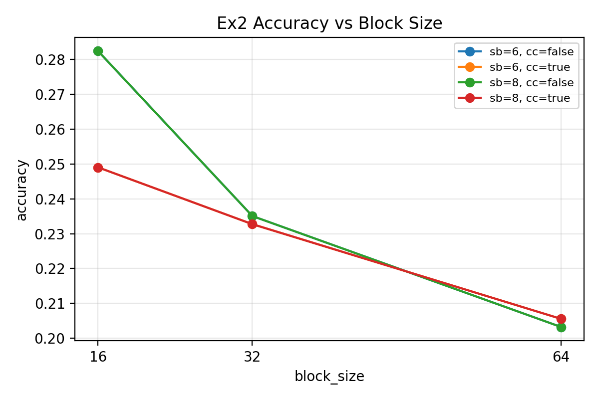
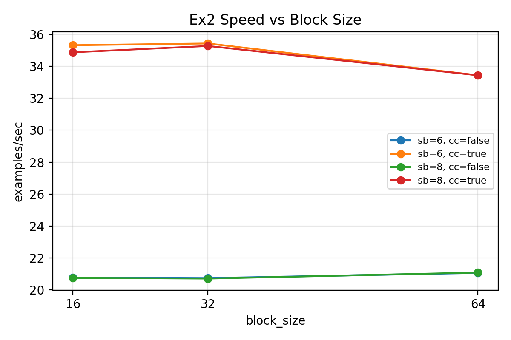

# Microxcaling (MX) Quantization Report
**Author:** Shrenik Bhansali 
**Compute:** Tesla T4 via Colab

---

## 1. Background
### 1.1 MX Emulator: Quantization + Rounding 
MX is a block floating‑point quantization scheme. For a chosen axis (we use the last dimension), tensors are partitioned into blocks of size `block_size`. A shared scale is computed per block by the MX library, elements are normalized by that scale, and then rounded/clamped to the target element format. In this project the element formats are **fp6_e2m3** for activations and **fp4_e2m1** for weights and KV. (The assignment uses the naming `mxfp6_e2m3` / `mxfp4_e2m1`; the MX library refers to these as `fp6_e2m3` / `fp4_e2m1`.) 

Larger `block_size` reduces scale‑overhead but reduces adaptivity; fewer `scale_bits` reduces dynamic range, increasing quantization error. The MX README notes that MX‑compatible formats typically use `block_size=32`; we sweep 16/32/64 as exploratory settings.

Rounding behavior follows the MX library defaults. The MX defaults use `round='nearest'` (according to the microxcaling README). When `custom_cuda=True`, the MX CUDA path is used where available; otherwise the emulator path is used. We wanted to ablate the different rounding methods in the library, but we ran out of compute on Colab (there are finite GPU usage limits on Colab.)

### 1.2 Evaluation protocol (common across runs)
- Task: `lambada_openai`; metrics: accuracy and perplexity. 
- Exercise 1 (Ex1) sweeps used the full evaluation set.
- Exercise 2 (Ex2) sweeps used `--limit 0.25`, so the runtime/throughput numbers are **not directly comparable** to baseline/Ex1. However, we include a full evaluation run of one of the Exercise 2 runs for completeness. 
- Throughput is reported as `examples/sec = n_effective / total_evaluation_time_seconds`, as derived from each JSON (see Appendix A).

### 1.3 Overall headline results across stages
**Table 1: Headline results (baseline vs best Ex1 vs best Ex2)**

| Config | acc (±stderr) | ppl (±stderr) | eval_time_s | examples/sec | Notes |
|---|---:|---:|---:|---:|---|
| Baseline | 0.622356 ± 0.006754 | 5.428514 ± 0.128561 | 492.293 | 10.467 | Full eval |
| Ex1 best (accuracy) | 0.537745 ± 0.006946 | 8.385442 ± 0.228826 | 879.974 | 5.856 | bs=16, sb=6, custom_cuda=false |
| Ex1 best (speed) | 0.516398 ± 0.006962 | 9.158226 ± 0.260625 | 485.907 | 10.605 | bs=16, sb=8, custom_cuda=true |
| Ex2 full eval (bs=16, sb=6, cc=false) | 0.3365 ± 0.0066 | 41.7107 ± 1.7549 | — | — | **Ex1+KV**, full eval (limit=None) |
| Ex2 best (accuracy, limited) | 0.282389 ± 0.012543 | 69.508932 ± 6.364539 | 248.117 | 5.195 | **Ex1+KV**, limited eval (`n=1289`) |
| Ex2 best (speed, limited) | 0.232739 ± 0.011775 | 116.807703 ± 11.175438 | 145.411 | 8.865 | **Ex1+KV**, limited eval (`n=1289`) |

---

## 2. Exercise 1 — MX-quantized linear layers
### 2.1 What I implemented (Ex1)
- Replaced transformer linear layers with MX-integrated linear ops.
- Quantized attention projections (Q/K/V/O) and MLP projections (up/down/gate or equivalents).
- Swept `block_size ∈ {16, 32, 64}` and `scale_bits ∈ {6, 8}`; also compared `custom_cuda ∈ {false, true}`.
- Formats were fixed by the assignment: weights `fp4_e2m1`, activations `fp6_e2m3`.
- MX specs are defined once and can be overridden via CLI: `scripts/run_lm_eval_mx.py` uses `add_mx_args` + `get_mx_specs` to produce a JSON spec, exports it as `MX_SPECS_JSON`, and `modeling_llama.py` reads it, finalizes it, and **enforces** `w_elem_format=fp4_e2m1` and `a_elem_format=fp6_e2m3` per the assignment.

### 2.2 Where quantization acts (Ex1)
Quantization is applied inside each transformer block’s linear projections. We use `MxLinear(..., mx_specs=_LLAMA_MX_SPECS)` for Q/K/V/O and MLP up/down/gate, so both weights and activations are quantized per forward pass. The `block_size` grouping is along the last dimension of each matmul (the hidden size / head dimension), which means a single scale is shared across contiguous chunks of the inner dimension. In the emulator path, quantization is simulated in Python/torch around the matmul; with `custom_cuda=True` the MX CUDA path is used where available.

### 2.3 Experimental setup (Ex1-specific)
- Full evaluation data (no limit).
- Metrics: accuracy / perplexity (stderr from `lm_eval`).
- Throughput derived as `examples/sec` (Appendix A).

### 2.4 Headline results (Ex1)
(From Table 1)
- Ex1 best (accuracy): **0.537745 ± 0.006946** acc, **8.385442 ± 0.228826** ppl, **879.974** eval_time_s, **5.856** examples/sec (bs=16, sb=6, custom_cuda=false).
- Ex1 best (speed): **0.516398 ± 0.006962** acc, **9.158226 ± 0.260625** ppl, **485.907** eval_time_s, **10.605** examples/sec (bs=16, sb=8, custom_cuda=true).

### 2.5 Sweep results and figures (Ex1)
The sweep suggests that accuracy changes modestly across `{16, 32, 64}` and `{6, 8}`, while `custom_cuda` introduces a consistent accuracy drop but improves speed substantially.

Several `scale_bits=6` vs `scale_bits=8` pairs are numerically identical in the sweep. This can occur even when scale_bits is wired correctly if the shared exponent never exceeds the 6‑bit clamp range (see Appendix D).

**Figure 1:** Ex1 accuracy vs block_size  

We plot the accuracy against block size in Figure 1. You can see when custom CUDA is false, increasing block size degrades performance. When custom CUDA is true, a low block size still yields the strongest performance.

**Figure 2:** Ex1 throughput vs block_size  

Here we see behavior again diverge based on the custom CUDA - when true, increasing block size seems to degrade throughput, when false, increase block size increases throughput. 

### 2.6 Exercise 1 discussion
- Relative to baseline (Table 1), Ex1 reduces accuracy; the most accurate Ex1 configuration is also substantially slower.
- `custom_cuda=true` largely recovers throughput (near-baseline examples/sec) but at a noticeable accuracy cost.
- The MX README notes the CUDA path can be more numerically accurate to the intended MX behavior than the PyTorch emulator path; the consistent accuracy delta suggests the emulator and CUDA quantizers are not identical, and CUDA may be closer to the intended MX behavior for this format.
- Within the swept range, `block_size` and `scale_bits` appear to have smaller effects than toggling the CUDA path.

### 2.7 Full ablations
See Appendix B.1 for the full Exercise 1 sweep table.

---

## 3. Exercise 2 — MX-quantized KV in eager attention
### 3.1 What I implemented (Ex2)
- Forced the eager attention path in `LlamaAttention.forward`.
  - Implementation detail: set `attention_interface = eager_attention_forward` unconditionally so KV quantization runs regardless of config._attn_implementation.
- Quantized **K and V** after `repeat_kv` and before attention matmuls using `quantize_mx_op(..., elem_format=\"fp4_e2m1\", axes=[-1], round=_LLAMA_MX_SPECS[\"round_mx_output\"])`.
- Used the same sweep over `block_size`, `scale_bits`, and `custom_cuda`.
- KV element format was fixed to `fp4_e2m1` per the assignment.

> Note: Exercise 2 results are layered on top of Exercise 1 in my implementation, so they represent **Ex1 + KV quantization**, not KV-only.

### 3.2 Where quantization acts (Ex2)
Quantization is applied directly to K and V before `QK^T` and `softmax(QK^T)V`. We quantize along the last dimension (head dimension), so each block in head_dim shares a scale. This impacts attention scores and value aggregation and can be particularly sensitive because errors affect token‑to‑token routing.

### 3.3 Experimental setup
- Sweeps used `--limit 0.25` to reduce compute, due to GPU usage limits on colab.
- Metrics: accuracy / perplexity (stderr from `lm_eval`).
- Because `--limit 0.25` changes the evaluation workload, sweep runtime/throughput values are **not directly comparable** to baseline/Ex1.
- A full Ex2 evaluation without `--limit` was also run for `bs=16, sb=6, custom_cuda=false` (see Table 1).

### 3.4 Headline results (Ex2)
(From Table 1)
- Ex2 best (accuracy, limited): **0.282389 ± 0.012543** acc, **69.508932 ± 6.364539** ppl (**Ex1+KV**, limited eval).
- Ex2 best (speed, limited): **0.232739 ± 0.011775** acc, **116.807703 ± 11.175438** ppl (**Ex1+KV**, limited eval).
- Ex2 full eval (bs=16, sb=6, cc=false): **0.3365 ± 0.0066** acc, **41.7107 ± 1.7549** ppl (**Ex1+KV**, limit=None).

### 3.5 Sweep results and figures (Ex2)
Across all settings, KV quantization significantly degrades accuracy. Changing block size / scale bits has smaller effect than the overall shift from quantizing KV.

**Figure 3:** Ex2 accuracy vs block_size  

In Figure 3, we can clearly see that increasing block size consistently degrades performacne. 

**Figure 4:** Ex2 throughput vs block_size  

In Figure 4, we see that the block size does not have a signifcant effect or clear relationship on the model's throughput. 

### 3.6 Exercise 2 discussion
- KV quantization (on top of Ex1) causes a sharp accuracy collapse on this benchmark (Table 1), suggesting KV is much more precision-sensitive than Ex1’s linear-layer quantization in this setup.
- Within the swept range, adjusting `block_size` / `scale_bits` does not recover most of the lost accuracy; the dominant effect is the presence of KV quantization itself.
- While we intended to run more ablations / use the full eval set for the benchmarks, we were practically compute-bound by colab. 

### 3.7 Full ablations
See Appendix B.2 for the full Exercise 2 sweep table.

---

## 4. Broader discussion
### 4.1 Balancing accuracy and efficiency
Based on these results:
- For linear-layer MX (Ex1), a practical strategy is to choose the smallest accuracy drop that meets a speed target. In this setup, `custom_cuda=true` appears to be the dominant lever for speed, while `block_size`/`scale_bits` have second-order effects.
- For KV quantization (Ex2), the accuracy cost dominates; applying KV quantization at this precision level is not acceptable if maintaining `lambada_openai` accuracy is the primary goal.

### 4.2 Key considerations: weights vs activations vs KV cache
- **Weights/activations (Ex1):** accuracy drop is noticeable but not catastrophic; performance depends strongly on kernel path (`custom_cuda`).
- **KV cache (Ex2):** accuracy is far more sensitive, consistent with KV affecting attention routing directly.

### 4.3 Failure mode observed
The primary failure mode in these results is the sharp accuracy collapse when KV is quantized to the tested precision formats/configurations, suggesting that either (a) KV needs higher precision than weights/activations, or (b) KV quantization requires more careful scaling/outlier handling.

### 4.4 Ideas to improve results (including <4-bit)
- **KV-specific improvements:** higher precision KV than weights/acts, per-head scaling, or outlier-aware scaling for K/V.
- **Calibration:** collect activation/KV statistics on a small calibration set to choose better scales.
- **Mixed precision:** keep a subset of layers (or attention) at higher precision while quantizing the rest.
- **KV-only ablation:** run KV quantization without Ex1 linear quantization to isolate KV sensitivity from Ex1 effects.
- **Below 4-bit:** would likely require more sophisticated scaling/quantization (e.g., learned scales, non-uniform quantization) and careful kernel support; the main challenge is handling outliers and preserving attention score quality.

---

## 5. AI Use Disclosure
I used ChatGPT to help write the report for clarity and conciseness. In terms of implementation, the wiring for the CLI was done through a coding agent, but the actual implemenation for Exercise 1 was done by hand. The values were originally hardcoded in, but I had the agent make them override-able via the CLI. 

For Exercise 2, I detailed to the coding agent what modifications to make. I specified to perform the quantization immediately after `repeat_kv` and before matmuls, via quantize_mx_op on the key and value states using axes=[-1].

The wrapper scripts for the ablations were generated by a coding agent, after I specified which hyperparams to target / what values to use and so on. I confirmed the selected hyperparameters were actually reaching the script / the AI-generated logic was sound through some simple python commands. 

The scripts to generate figures were also AI-generated, but I confirmed that the values pulled from the results files were correct and so on. 

---

# Appendix

## Appendix A: How metrics were extracted (parsing summary)
- Parsed `acc,none`, `perplexity,none`, their stderr, and `total_evaluation_time_seconds` from each `lm_eval` JSON.
- Extracted `block_size`, `scale_bits`, `custom_cuda` from run directory naming convention.
- Computed `examples/sec = n_effective / total_evaluation_time_seconds`, where `n_effective` is taken from each JSON (`n-samples.lambada_openai.effective`). For Ex1 this is 5153; for Ex2 with `--limit 0.25` this is 1289.
- Raw results are stored under `colab_results/content/results/{baseline,ex1,ex2}/`.

## Appendix B: Full sweep tables

### Appendix B.1 Exercise 1 sweep table

#### Table 2.1: Exercise 1 sweep results (from colab_results)
| block_size | scale_bits | custom_cuda | acc (±stderr) | ppl (±stderr) | eval_time_s | examples/sec | run_id |
|---:|---:|:---:|---:|---:|---:|---:|---|
| 16 | 6 | false | 0.537745 ± 0.006946 | 8.385442 ± 0.228826 | 879.974 | 5.856 | 20260207_220640_bs16_sb6_ccfalse |
| 16 | 6 | true | 0.516398 ± 0.006962 | 9.158226 ± 0.260625 | 496.202 | 10.385 | 20260207_215813_bs16_sb6_cctrue |
| 16 | 8 | false | 0.537745 ± 0.006946 | 8.385442 ± 0.228826 | 913.943 | 5.638 | 20260207_214248_bs16_sb8_ccfalse |
| 16 | 8 | true | 0.516398 ± 0.006962 | 9.158226 ± 0.260625 | 485.907 | 10.605 | 20260207_213432_bs16_sb8_cctrue |
| 32 | 6 | false | 0.528624 ± 0.006955 | 8.922927 ± 0.246838 | 877.746 | 5.871 | 20260207_225322_bs32_sb6_ccfalse |
| 32 | 6 | true | 0.510188 ± 0.006965 | 9.417524 ± 0.268060 | 496.626 | 10.376 | 20260207_224452_bs32_sb6_cctrue |
| 32 | 8 | false | 0.528624 ± 0.006955 | 8.922927 ± 0.246838 | 879.885 | 5.856 | 20260207_223000_bs32_sb8_ccfalse |
| 32 | 8 | true | 0.510188 ± 0.006965 | 9.417524 ± 0.268060 | 496.597 | 10.377 | 20260207_222132_bs32_sb8_cctrue |
| 64 | 6 | false | 0.516398 ± 0.006962 | 9.236667 ± 0.256585 | 866.146 | 5.949 | 20260207_234020_bs64_sb6_ccfalse |
| 64 | 6 | true | 0.510576 ± 0.006964 | 9.501932 ± 0.270881 | 514.174 | 10.022 | 20260207_233135_bs64_sb6_cctrue |
| 64 | 8 | false | 0.516398 ± 0.006962 | 9.236667 ± 0.256585 | 866.753 | 5.945 | 20260207_231658_bs64_sb8_ccfalse |
| 64 | 8 | true | 0.510576 ± 0.006964 | 9.501932 ± 0.270881 | 518.683 | 9.935 | 20260207_230810_bs64_sb8_cctrue |

### Appendix B.2 Exercise 2 sweep table

#### Table 2.2: Exercise 2 sweep results (from colab_results)
| block_size | scale_bits | custom_cuda | acc (±stderr) | ppl (±stderr) | eval_time_s | examples/sec | run_id |
|---:|---:|:---:|---:|---:|---:|---:|---|
| 16 | 6 | false | 0.282389 ± 0.012543 | 69.508932 ± 6.364539 | 248.117 | 5.195 | 20260208_014818_bs16_sb6_ccfalse |
| 16 | 6 | true | 0.249030 ± 0.012050 | 98.970079 ± 9.549647 | 145.857 | 8.837 | 20260208_014540_bs16_sb6_cctrue |
| 16 | 8 | false | 0.282389 ± 0.012543 | 69.508932 ± 6.364539 | 248.341 | 5.190 | 20260208_014121_bs16_sb8_ccfalse |
| 16 | 8 | true | 0.249030 ± 0.012050 | 98.970079 ± 9.549647 | 147.716 | 8.726 | 20260208_013843_bs16_sb8_cctrue |
| 32 | 6 | false | 0.235066 ± 0.011815 | 100.705567 ± 9.020378 | 248.512 | 5.187 | 20260208_020214_bs32_sb6_ccfalse |
| 32 | 6 | true | 0.232739 ± 0.011775 | 116.807703 ± 11.175438 | 145.411 | 8.865 | 20260208_015936_bs32_sb6_cctrue |
| 32 | 8 | false | 0.235066 ± 0.011815 | 100.705567 ± 9.020378 | 248.882 | 5.179 | 20260208_015516_bs32_sb8_ccfalse |
| 32 | 8 | true | 0.232739 ± 0.011775 | 116.807703 ± 11.175438 | 146.060 | 8.825 | 20260208_015237_bs32_sb8_cctrue |
| 64 | 6 | false | 0.203258 ± 0.011213 | 146.498735 ± 13.581078 | 244.696 | 5.268 | 20260208_021615_bs64_sb6_ccfalse |
| 64 | 6 | true | 0.205586 ± 0.011261 | 165.580297 ± 15.863741 | 154.085 | 8.366 | 20260208_021332_bs64_sb6_cctrue |
| 64 | 8 | false | 0.203258 ± 0.011213 | 146.498735 ± 13.581078 | 244.419 | 5.274 | 20260208_020917_bs64_sb8_ccfalse |
| 64 | 8 | true | 0.205586 ± 0.011261 | 165.580297 ± 15.863741 | 154.078 | 8.366 | 20260208_020633_bs64_sb8_cctrue |

## Appendix C: Full environment info
- Full `pretty_env_info` output (baseline + one representative Ex1/Ex2 run).

## Appendix D: Why `scale_bits` may show no metric change
`scale_bits` controls the bitwidth of the shared scale/exponent in MX (microxcaling README). If the shared-scale values needed for the tensors already fall within the representable range at 6 bits, then `scale_bits=6` and `scale_bits=8` can yield identical quantized tensors and metrics. This can happen in practice if the blockwise dynamic range is modest for the tensors being quantized (e.g., K/V in this setup).
